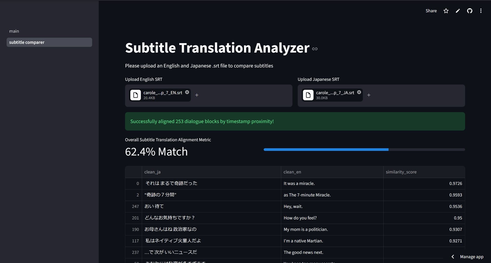

# Cross-Language-Semantic-Distance-Visualizer
A modular data science pipeline and interactive dashboard that mathematically quantifies and visualizes "Semantic Drift" between English and Japanese parallel sentences. By mapping high-dimensional vector embeddings into a shared 2D space, this tool exposes where contextual nuances, idioms, and cultural pragmatics diverge.
Longer distance between two corresponding points means their meanings are less similar, while closer distances signal higher similarity in meaning.
<div align="center">

  
  
### [**Try it out here!**](https://cross-language-semantice-distance-visualizer.streamlit.app/)

</div>

I've provided a database that's coordinates have already been calculated. You can see the original data for the database in [english-japanese-raw-parallel.xlsx](data/raw/english-japanese-raw-parallel.xlsx)
### Subtitle Analysis

A subtitle analysis page has been made to compare how accurate a subbed piece of media between English and Japanese. Upload two srts to compare. The median similarity is shown as well as a detailed break down of each sub's similarity.
<div align="center">
  
</div>

I've provided sample srts for the 7th episode of Carole & Tuesday in `data\raw`

---

##  Features

- **Automated SQLite Database:**  backend pipeline that automatically caches sentence vectors and UMAP coordinates upon first launch, eliminating redundant deep-learning computation.
- **Multilingual Vector Alignment:** Leverages Hugging Face's `paraphrase-multilingual-MiniLM-L12-v2` transformer model to map diverse language characters into a unified mathematical space.
- **Dimensionality Reduction:** Compresses 384-dimensional vector embeddings down to a human-viewable 2D topography using UMAP while preserving relative linguistic proximity.
- **Interactive UI Dashboard:** Built with Streamlit and Plotly to allow dynamic category filtering and structural gap analysis.

## Running on local machine

1. Clone this repository.

2. Navigate to project directory

3. Set up virtual environment

```
python -m venv .venv

# Windows command prompt
.venv\Scripts\activate.bat

# Windows PowerShell
.venv\Scripts\Activate.ps1

# macOS and Linux
source .venv/bin/activate
```

4. Run the command `pip install -r requirements.txt` in the terminal

5. To start app run `streamlit run main.py` in the terminal

alternatively try `python -m streamlit run main.py`

**If you want to edit the provided database you will need a Hugging Face token to generate vectors**

Create a `.streamlit` directory and inside that directory make `secrets.toml`. In you secrets file enter this line `HF_TOKEN = "your-token-here"` and replace it with your token.

---

## Limitations
The app works only for English-Japanese paired phrases, but theoretically could work for any two language supported in [sentence-transformers/paraphrase-multilingual-MiniLM-L12-v2 ](https://huggingface.co/sentence-transformers/paraphrase-multilingual-MiniLM-L12-v2). The structure of the project would need to be slightly adapted to deal with more languages.

The current dataset was quickly put together and I think if a more carefully dataset of sentences was created then the results could be more useful to look at.
Also to make a new databse the old database has to be deleted. To generate a new database the excel file has to be formated specifically with English-Japanese labels, but this can be changes to be more accepting of different types. This may be a feature I add in the future to accept excel files right in the dashboard.

## Background
Developed as an independent undergraduate research track project exploring the intersection of Computational Linguistics and Artificial Intelligence at Purdue University.

Developer: Myra Bagga
